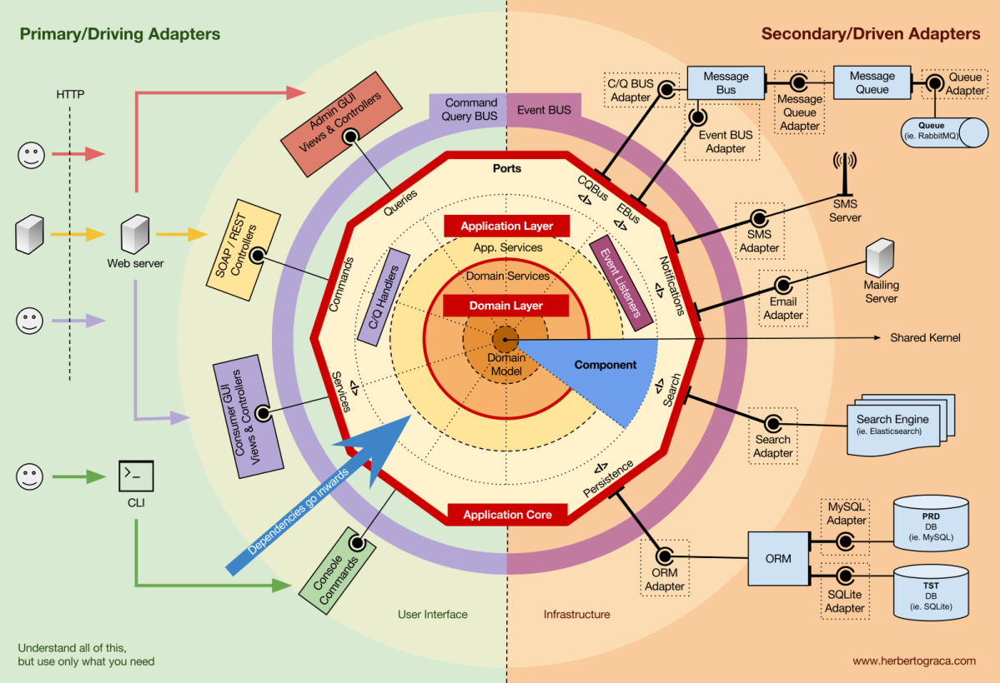
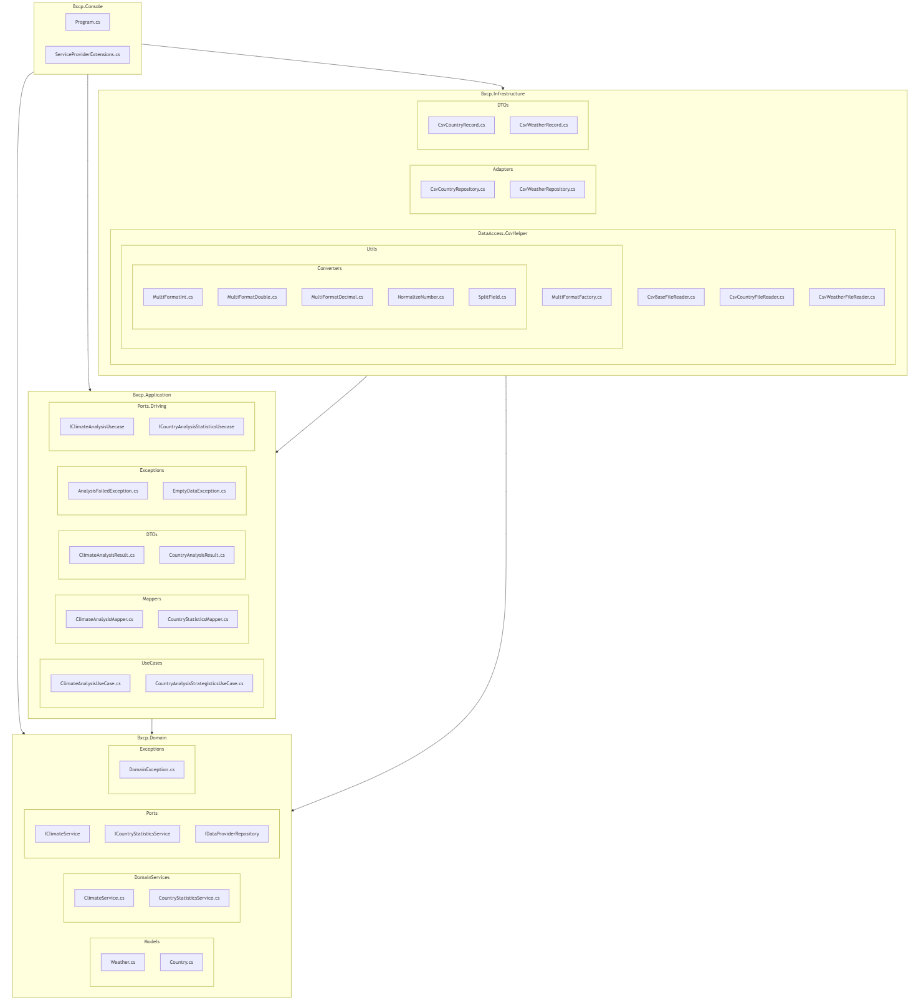
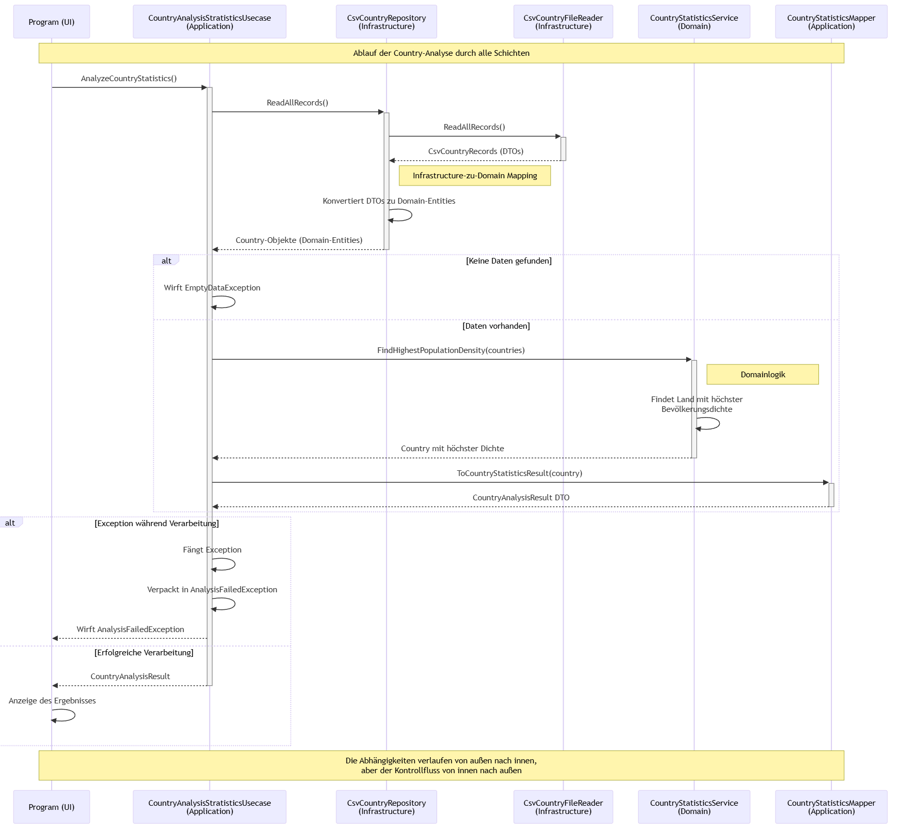

  

# [BettercallPaul Programming Challenge](https://github.com/bettercodepaul/programming-challenge)

Grundsätzlich gilt es Aufgaben, hauptsächlich zur Datenanalyse zu lösen:

- **Klimaanalyse**: Finden des Tages mit der kleinsten Temperaturschwankung
- **Länderstatistik**: Ermitteln des Landes mit der höchsten Bevölkerungsdichte

Obwohl beide Analysen technisch ähnlich sind (CSV-Daten einlesen und auswerten), repräsentieren sie unterschiedliche Fachgebiete.

## Ziele

Die Ziele wurden durch den Stakeholder "BettercallPaul" bereits festgelegt.

|   Qualitätsziel   |   Was bedeutet das für mich, was verstehe ich darunter?   |
| --- | --- |
|   **Robustheit & Korrektheit** (robustness & correctness)   |   Software muss unter allen Umständen funktionieren, nicht nur im Geradeausfall. Konsequente Validierung aller Eingaben, durchdachte Fehlerbehandlung und umfassende Tests.   |
|   **Lesbarkeit & Wartbarkeit** (readability & maintainability)   |   Code wird häufiger gelesen als geschrieben. Klare Benennungen, konsistente Strukturen und nachvollziehbare Logik schaffen Code, den andere (und ich selbst in 6 Monaten) sofort verstehen. Wartbarkeit ist kein Luxus, sondern wirtschaftliche Notwendigkeit.   |
|   **Sauberes Softwaredesign** (clean software design & architecture)   |   Gute Architektur reduziert Komplexität durch sinnvolle Abstraktion. Die Trennung von Fachlogik und technischen Details z.B. "CSV auslesen" macht ein System zukunftssicher und flexibel. Mit fokussierten Komponenten und definierten Schnittstellen schaffe ich ein System, das organisch mitwachsen kann, statt unter seinem eigenen Gewicht zu brechen. Stichwort: "Big Ball of Mud"   |

***

## Technische Randbedingungen

- [`.NET 8.0 (LTS), C#`](https://dotnet.microsoft.com/en-us/download/dotnet/8.0) mit Support bis November 2026
- [`CsvHelper`](https://joshclose.github.io/CsvHelper/) für CSV-Dateiverarbeitung
- [`Microsoft.Extensions.DependencyInjection`](https://www.nuget.org/packages/microsoft.extensions.dependencyinjection) für  DependencyInjection
- [`xUnit`](https://xunit.net/) als Testing-Framework
- [`Moq`](https://github.com/devlooped/moq) als Mocking-Framework
- [`Roslyn Analyzer`](https://learn.microsoft.com/en-us/visualstudio/code-quality/roslyn-analyzers-overview?view=vs-2022) für Statische Codeanalyse und Qualitätssicherung
- [`GitHub Action, CI-Pipeline`](https://github.com/lucawun/Bxcp/actions/workflows/ci-pipeline.yml) für automatische Tests bei jedem Push ins Repo
- [`GitHub Dependabot`](https://github.com/lucawun/Bxcp/actions/workflows/dependabot/dependabot-updates) für automatische Abhängigkeits-Aktuallisierung

### Disclaimer zu KI-Unterstützung

Für die Erstellung wurden KI-gestützte Tools, Typing Mind (via Claude 3.7 Sonnet) und GitHub Co-Pilot (via GPT-4o) genutzt.

## Die Lösung: Hexagonal/Onion-Architektur

Die Hexagonale Architektur (auch "Ports & Adapters" oder "Onion Architecture" genannt) funktioniert wie eine Zwiebel mit mehreren Schichten:

[Quelle: Blog Herberto Graca](https://herbertograca.com/2017/11/16/explicit-architecture-01-ddd-hexagonal-onion-clean-cqrs-how-i-put-it-all-together/comment-page-1)

Anders ausgedrückt: Im Zentrum steht die eigentliche Fachlogik (Was wird berechnet?), umgeben von UseCases (Wie wird es genutzt?), und außen ist die technische Umsetzung / Infrastruktur (Woher kommen die Daten?).

### Warum habe ich mich dafür entschieden?

- Die eigentliche Analyselogik bleibt unabhängig von technischen Details wie Dateiformat oder Benutzeroberfläche.
- Wenn sich die Datenquelle ändert (z.B. von CSV zu JSON oder Datenbank), muss ich nur die äußere Schicht anpassen, nicht die Kernlogik.
- Die klare Trennung ermöglicht isoliertes Testen jeder Komponente ohne Abhängigkeiten zu externen Systemen, was die Codequalität verbessert und Wartung vereinfacht.
- Präzise Fehlerbehandlung auf jeder Ebene - fachliche Fehler in der Domäne, Prozessfehler in der Anwendungsschicht, technische Fehler in der Infrastruktur.

### 1. Domänenschicht (Core) `Bxcp.Domain` 

Der Kern meines Systems, der die eigentliche Fachlichkeit enthält – ohne Abhängigkeiten zu externen Systemen.

- Definiert die beiden Models `Weather` und `Country`
- Entwicklung nach DDD, BDD, TDD-Prinzipien
- Enthält Domain Services Analyselogik (kleinste Temperaturschwankung finden, höchste Bevölkerungsdichte ermitteln)
- Legt Schnittstellen (Ports) fest, über die mit der Außenwelt kommuniziert wird

Durch die Isolation der Fachlogik stelle ich sicher, dass sie verständlich bleibt, unabhängig von technischen Details funktioniert, von meinen Stakeholdern leicht nachvollzogen und leicht getestet werden kann.

### 2. Anwendungsschicht  `Bxcp.Application` 

Die Schicht, die UseCases beinhaltet und zwischen Domäne und Infrastruktur vermittelt.

- Steuert den Ablauf der UseCases (Klimaanalyse / Länderstatistik)
- Übersetzt zwischen Domänenmodellen und externen Repositories
- Kümmert sich um die übergreifende Fehlerbehandlung

Es schafft eine klare Struktur und macht den Code selbsterklärend – jeder UseCase ist eine eigene abgeschlossene Einheit mit einem eindeutigen Zweck.

### 3. Infrastrukturschicht `Bxcp.Infrastructure` 

Die äußerste Schicht, die konkrete technische Implementierungen enthält.

- CSV-Datenzugriff über das Repository-Pattern
- Transformation externer Daten in Domänenmodelle
- Stellt technische Services bereit

Die gemeinsame Schnittstelle `IRepository<T>` mit spezifischen Implementierungen für Wetter- und Länderdaten sorgt für eine klare Trennung zwischen Datenzugriff und -verarbeitung. Diese Kapselung schützt die Kernlogik vor technischen Änderungen und erhält die Stabilität der Fachlogik bei Technologiewechseln.

[Quelle: Übersicht Architektur als Komponentendiagramm / generiert via Claude 3.7 Sonnet + Mermaid Live Editor](https://mermaid.live/edit#pako:eNqdVttu4jAQ_RXkZ4oIBCh5WIkmoOWBFgHdSrvsg5sYsJSbbIeFrfrvO84FEuyQavMAvpzxHI_PjP2B3MgjyEI7P_rjHjATrc3TNmzBx5P3PcPxoWVHIY988muLnk5u3Mm7W_Q7w8lvySLABgDJWx2XVwBrwo7UJTB7pB5h05MArDpIQk5h-bI1Cb2sccPKiQJMw4JU1qu4vEEuYJ8-B3zWqEDl97aAuTeCxYGwW_bys-W8HSWhYOfb-QvHK08Ng3y7kkN1QPHlrA3pzKcBFiRH6Tg5696V1FpgQbmgLq-x-BrLZcSEpJj-qx6Xc5ibV6lpUHaKqiGmwa8k3sECF2JYkTjiVETs_B97mJ5cEgupJFj22lH9Ti9ncUHVRq1OiJM49qmLpW2hxtKQXpKvnNiYp1Iomgq5V7skgkmI_TOnPEfrxPBql8RQ4NeCgfU-C3-NcVNMFziOCUtTJ2sprhcTDdUMrGO6mGhlqzdoPPHNS5pR8Kee7-ZFQ2xFeOILbT5tXjQx1OObeIEGvirDyVSyLNzNMPWJV6vHzEDSnAaxOMucadZuXewYPdJwX0n5Tj6oBgfGl0Yp-0uadEFWeoNeqRBcRVkcuc60MeHm4Y5hLljiioRdrqXqaM1NAMGauFBxU8VcOh2bH78TH8Sn7iFTNj8-Ac0ZHMyKYE-vaidTNT_mu21C9zN0fuXcR1d71zIiaHqlpf-KUVoUNpL_AvRLZxGDU5thVxZVnRPV0e0z4EiYyCrBtaNdJr0wf9y4noeizm2G71XxTpS8--S-Sf_GhLggTf--jQk2zxLu07_kOQne9TG_GgzkWwUquphR4nt12EqyKQON5cLDcR7boqmmvWNUFHa9I7VFwulVFFaPbuKWpta9OjtXiLkR0wZqrpDSIetKQP70bD08fCtfu-rkTTFQ5vPnYjpeWkiZq67zlWmFVvbr-pjz3LZdwrSrS7QLkjSIoRjjUKA22jPqIQsgpI0CArqVXfQhF94iCGIA1c6Cpkd2GFJhi7bhJ5jFOPwZRUFhyaJkf0DWDvsceknsQQV3KJaP9csog3gTlh4iskbpEsj6QCdk9YfjjjEyh2Z32DeGw0Gvjc7IejBNo9M1hr3-4HHYHY265mcb_U2dGp2BMXo0e6ZhjMfmuG9-_gOpSrev)

***

[Quelle: Beispiel-Workflow: Länderstatistik als Sequenzdiagramm / generiert via Claude 3.7 Sonnet + Mermaid Live Editor](https://mermaid.live/edit#pako:eNqNVdtuGkkQ_ZVWP7EKWDA2thmtLBEuWivO2oKwK614aWZqZjo03bN9IQHL37Iv-Yb8AD-21TOMzWUSBQk00OecqjpVXTzTSMVAQ2rgXwcygiFnqWaruST4ypm2POI5k5YMHu4JM-RJK39OGrP7385Bs4HHDJSTVm_6komN4WZqNbPcIMjMDETMwO8Lfdfo57ngEZ4oWaM0GT09FlpmvZebQK4Mt0pvCvq9TDQzVrvIOg01CuPJMX_MBUyAxaB_jT-YHtQytVUJU9BrHpUlDNWK8brsP_afaskfWZ7v45-XX37-qSwQtQbtHW-iUEj6C8FcQmL_W6nYKr0FEjsdZYQJAWQaZTzKLMi5LJWQ37q7ezcboIKHb-Esn8ZR6NnA473zIfFO9YWYQKR0_IrzZx4znvwIMZ60ENAqRQ6bV6BIY_jp0ZzXq3maWaISUvKOe9PaulbpNPH-cZkeJVNSPiiJnlmOb-JjkK0jJak1kpbjgTlg-RS9L5Wdj4vPsMQ8GieUo0yZsOQDcAlkyNBmkkLiZAx7t18N9Lp_c51YMlrldoNYNvoaQe47XUJBmEpjrXTGakTeDaYhGXMZ_4HOgLFPKneiGJYhSLwFm0ZUpP6W41ue5656sbIyoVK-fIMNphirCgWWPGAuZMUtyXbfo8zYclbfw3r3XSxBO5mauBiyI4kTN48FyPCEcFppMeKf1NlsTsA4Yfd1bg6qRMJpyGrVlBw_AHunZXzawddekC-7b5lGBPkLNNML4NZVo3XUzPHum0wPiDUQVMhZtLQEZ7TKZcxw4cT1LO_6w301Jz9lFMMy0okSqQa0En6crjelkK115aBlxWIokH25BZ7iHgGDQVJYSG5MdVVO3KvZTEMOuJ0ybxBPl5iSH2nQfl0Vwy0Jc7v_8FEyXFNcSpBNP1FsgSp-n-G1tVoJkQhnTEEoQCW-5NImTTWPaYj7AJp0BRoHGb_SZ5_WnNoMVjCnIT7GkDBfKZ3LF6ThKv5HqVXF1MqlGQ0Tho42qctjvIH7v7tXCJYMurCPhp2gkKDhM_1Kw6DXvbi5bHeuOtfXnZvLznWTbmjY6gYXQbfbuWnf9q6C26ur4KVJt0XQzkXQ7iL2thfc9tq9y3bw8j8V8HEp)

***

## Nachteile und Herausforderungen der Architektur

Für eine einfache Datenanalyse wie in dieser Aufgabe könnte der Architekturansatz zunächst überproportioniert wirken.

Die hexagonale Architektur führt auch zu mehr Klassen, Schnittstellen und Abstraktionsebenen als ein einfacherer, direkter Ansatz.
Mehr Code bedeutet mehr potenzielle Fehlerquellen, mehr Wartungsaufwand und mehr Einarbeitungszeit für neue Entwickler.

Ich wollte es praktisch ausprobieren - die Literatur und das eine oder andere Hobby-Projekt zur Hexagonalen Architektur kannte ich bereits, hatte jedoch nie ein Projekt von Grund auf neu damit aufgebaut. Daher habe ich es als persönliche kleine Challenge gesehen, das angeeignete Wissen anhand des Beispielprojekts in die Praxis umzusetzen.

Mein Zwischenfazit ist, dass die Architektur für diese spezifische Aufgabe zwar `overengineered` ist - bei größeren, komplexeren Projekten mit wachsenden Anforderungen sich der anfängliche Mehraufwand wahrscheinlich durch bessere Wartbarkeit und Erweiterbarkeit auszahlen würde.

Ich freue mich schon auf eine konstruktive Diskussion im Vorstellungsgespräch, wo wir darüber sprechen können, welche Aspekte der Architektur für verschiedene Anwendungsfälle doch sinnvoll sind und wo noch vereinfacht werden könnte.
Stichwort: **Vertical Slices**, fachliche Zusammengehörigkeiten besser gruppieren, Domain-Kern weiterhin isolieren, ... ?

***

## ToDos / Technische Schulden

- [x] Bessere Make-or-Buy-Entscheidung: Implementierung einer fertigen Lösung für das Auslesen von CSV-Dateien z.B. [`CsvHelper`](https://joshclose.github.io/CsvHelper) ebenso für die Spaltenzuordnung, bzw. das Mapping zwischen CSV-Spalten und Domänen/DTOs z.B. [`AutoMapper`](https://automapper.org).
- [ ] Bessere Testfälle (nicht teilweise KI generierte) - die genau das "wie" der Anwendung testen und nicht mögliche vorhandene Fehler abtesten
- [ ] Einsatz von [`Fluent Validation`](https://fluentvalidation.net) für bessere Validierungsprüfungen statt der Guard Clauses im Domain-Model, würde auch wieder die Testbarkeit erhöhen
- [ ] Integration eines strukturierten Logging-Frameworks wie [`Serilog`](https://serilog.net) oder [`NLog`](https://nlog-project.org), das verschiedene Log-Level unterstützt
- [ ] Dateipfade sind im Code festgelegt und nicht konfigurierbar -> Implementation einer Konfigurationsschicht, die Dateipfade aus Konfigurationsdateien oder Umgebungsvariablen liest.
- [ ] Update auf **.NET 10** im Nov. 2025, 36 Monaten Support (Nov. 2028) -> derzeit **.NET 8.0 (LTS)**, EOL: Nov. 2026